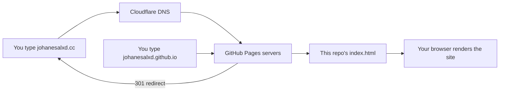
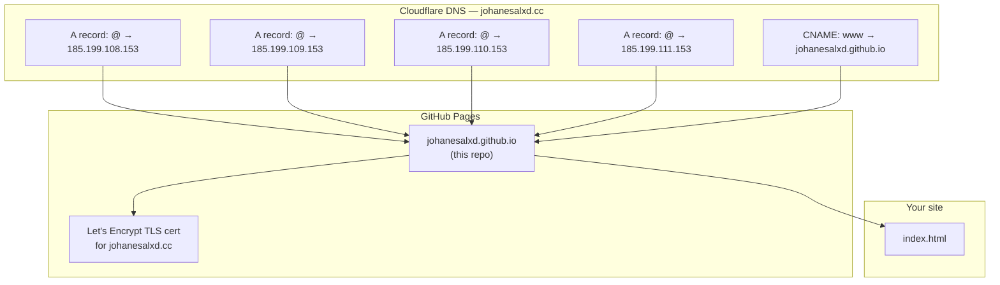
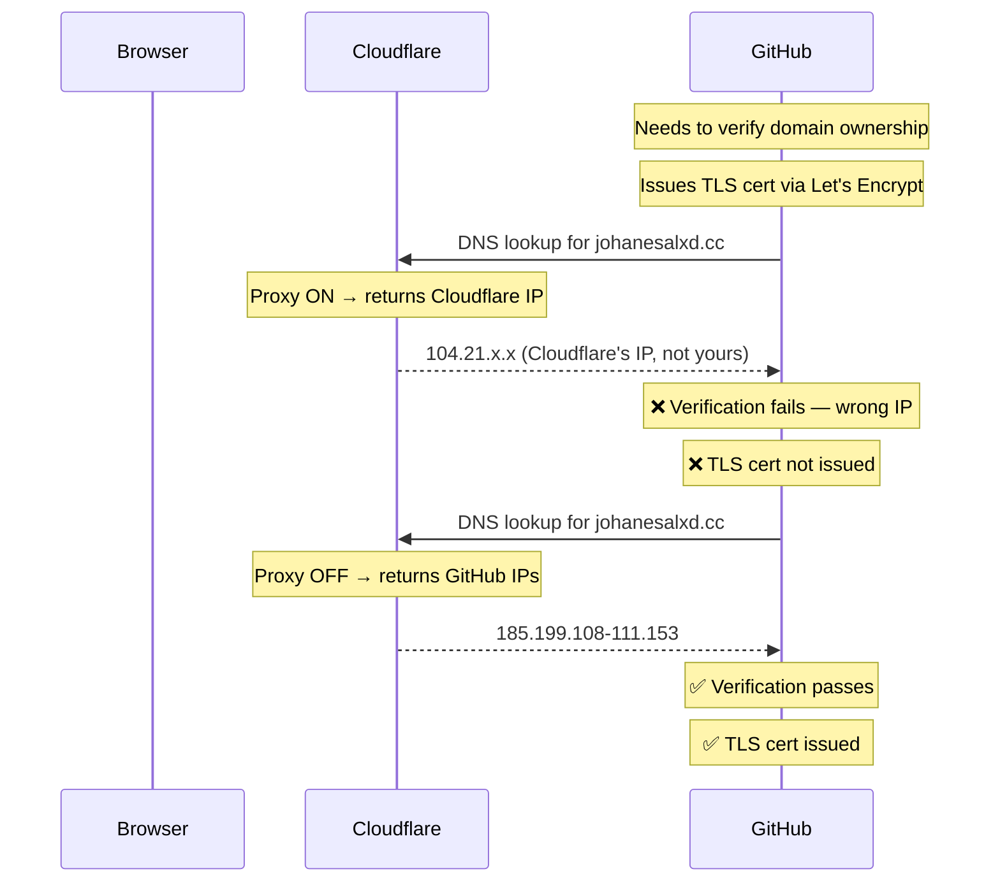
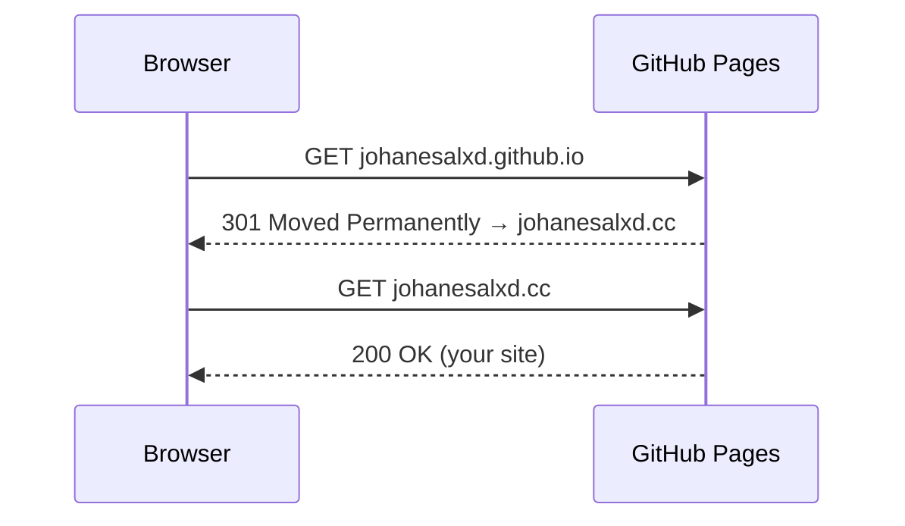

# johanesalxd.github.io

Personal site for [johanesalxd.cc](https://johanesalxd.cc) — Data & AI Architect.

> This README documents how the custom domain `johanesalxd.cc` was set up as the primary URL for this GitHub Pages site. Written as a personal learning reference — ELI5 style.

---

## How the site works (big picture)



Two entry points, one destination. `johanesalxd.cc` is the primary. `johanesalxd.github.io` automatically redirects to it.

---

## DNS explained (ELI5)

**DNS (Domain Name System)** is like the internet's phone book. When you type `johanesalxd.cc`, your browser doesn't know where to go — it asks DNS "hey, what's the address for this domain?" and DNS replies with an IP address (like `185.199.108.153`). Your browser then goes to that IP.

### Record types used here

#### A record — maps a domain to an IP address

```
johanesalxd.cc  →  185.199.108.153
```

"A" stands for **Address**. It's the most basic record: domain name → IPv4 address.

We use 4 A records pointing to 4 different GitHub IPs. This is intentional — GitHub runs multiple servers for redundancy. If one goes down, others handle the traffic.

```
johanesalxd.cc  →  185.199.108.153
johanesalxd.cc  →  185.199.109.153
johanesalxd.cc  →  185.199.110.153
johanesalxd.cc  →  185.199.111.153
```

#### CNAME record — maps a domain to another domain name

```
www.johanesalxd.cc  →  johanesalxd.github.io
```

"CNAME" stands for **Canonical Name** — an alias. Instead of pointing to an IP directly, it points to another domain name. That target domain then resolves to an IP.

Why use this for `www`? Because GitHub's IPs can change. If they do, only GitHub needs to update their DNS — your CNAME still works because it points to `johanesalxd.github.io`, not a raw IP.

**Important:** You can't use a CNAME on the root domain (`@` / `johanesalxd.cc`) — that's why root uses A records. CNAME on root breaks email and other records. This is a DNS spec rule.

#### What we did NOT use

- **AAAA record** — same as A but for IPv6 addresses (not needed here, GitHub handles it)
- **MX record** — for email routing (not set up)
- **TXT record** — for domain verification, SPF, DKIM (not needed for this setup)

---

## Full DNS setup diagram



---

## Why proxied: false on Cloudflare?

Cloudflare offers a **proxy mode** (orange cloud 🟠) that routes traffic through Cloudflare's network — useful for caching and DDoS protection.

For GitHub Pages custom domains, proxy mode **must be turned OFF** (grey cloud ⚫). Here's why:



Once the cert is issued and HTTPS is enforced, you *could* turn Cloudflare proxy back on — but it adds complexity with no real benefit for a simple static site. Keep it off.

---

## How the redirect works

Once the custom domain is set in GitHub Pages, GitHub automatically sends a **301 redirect** from `johanesalxd.github.io` to `johanesalxd.cc`.

A **301 redirect** means "moved permanently." Browsers remember it and go directly to the new URL next time. Search engines update their index to point to the new URL (good for SEO).



---

## How HTTPS works (TLS cert)

GitHub Pages auto-provisions a free TLS certificate via **Let's Encrypt** once:
1. DNS records are set correctly (IPs point to GitHub)
2. Custom domain is configured in repo Settings → Pages
3. GitHub can verify it controls the domain

This takes 5–30 minutes after DNS propagates. Once issued, enabling "Enforce HTTPS" in GitHub Pages settings forces all `http://` traffic to redirect to `https://`.

---

## Setup steps taken (2026-03-16)

1. **Bought domain** `johanesalxd.cc` on Cloudflare
2. **Wired Cloudflare MCP** (official Cloudflare API MCP server at `https://mcp.cloudflare.com/mcp`) to manage DNS programmatically
3. **Added DNS records** via MCP:
   - 4× A records: `@` → `185.199.108-111.153` (proxied: false)
   - 1× CNAME: `www` → `johanesalxd.github.io` (proxied: false)
4. **Set custom domain** on GitHub Pages via GitHub API: `cname: johanesalxd.cc`
5. **Pending:** Enable "Enforce HTTPS" in repo Settings → Pages once TLS cert is issued

---

## Can I make this repo private?

**No — don't do it.** GitHub Pages on free accounts only works with public repos for `username.github.io` sites. Making it private takes the site offline.

The site content is already public (anyone can visit it). The repo being public just means they can also see the source code — which is fine for a personal profile site.

---

## Glossary

| Term | What it means |
|---|---|
| **DNS** | Domain Name System — translates domain names to IP addresses |
| **A record** | Maps a domain to an IPv4 address |
| **CNAME** | Canonical Name — an alias pointing one domain to another |
| **TLS/SSL** | Encryption between your browser and the server (the padlock icon) |
| **Let's Encrypt** | Free certificate authority — GitHub uses it to auto-provision HTTPS certs |
| **301 redirect** | "Moved permanently" — tells browsers and search engines the canonical URL changed |
| **Proxied (Cloudflare)** | Orange cloud — traffic goes through Cloudflare's network. Off = grey cloud, direct to origin |
| **TTL** | Time To Live — how long DNS resolvers cache a record (1 = automatic) |

---

## Files in this repo

| File | Purpose |
|---|---|
| `index.html` | The actual website content |
| `CNAME` | Tells GitHub Pages what custom domain to use (auto-created by GitHub) |
| `README.md` | This file — setup documentation |
